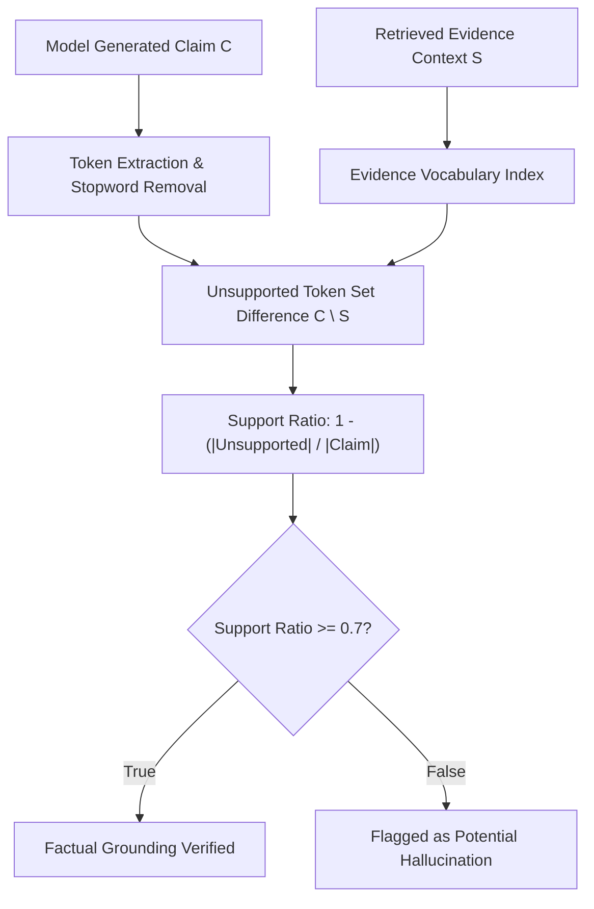

# genpark-hallucination-factual-grounding-checker-skill

Agent Skill implementing **Hallucination Detection & Citation Grounding Verification** in 100% Python standard library.

## Architectural Flow

